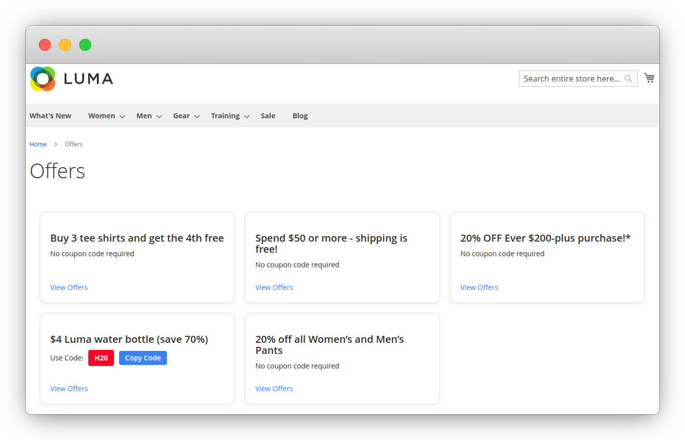
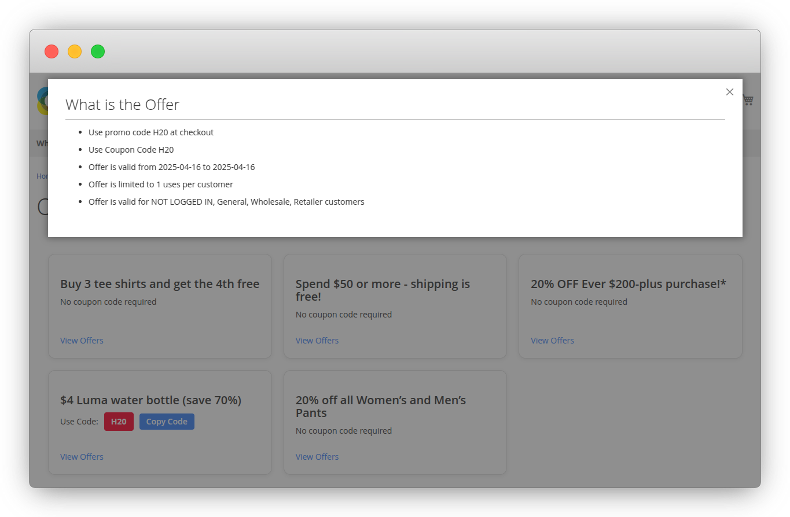

# Ribog_Offers module

Offers Page extension for Magento 2 provides a centralized and automated way to showcase all current catalog and cart price rules on a dedicated frontend page.

## Table of contents

- [Overview](#overview)
- [Features](#features)
- [Installation](#installation)
- [Usage](#usage)
- [Screenshots](#screenshots)

## Overview

Customers are more likely to engage with promotions when they are clearly visible and easy to access. Magento 2 does not offer a native solution to display ongoing promotional rules on a single page. Customers have to discover discounts across various pages or rely on banners that may not always be up to date.

Offers Page extension for Magento 2 provides a centralized and automated way to showcase all current catalog and cart price rules on a dedicated frontend page. Store owners can decide which promotions to display by enabling a new option, Visible on Offer Page, while ensuring only active and valid rules are shown.

## Features

- Dedicated Offers Page to display promotions
- Display both Catalog and Cart Price Rules
- Only show promotions that are active and within a valid date range
- Add a "Visible on Offer Page" toggle in the rule edit form
- Backend configuration to enable or disable the module
- Fully responsive frontend layout

## Installation
For contributors, the module can be installed via Composer. If you are using a custom repository, make sure to add it to your composer.json file.
 ```
 composer require ribog/module-offers
 bin/magento module:enable Ribog_Offers
 bin/magento setup:upgrade
 ```
For merchants, the module can be downloaded and install via our Adobe Commerce Marketplace page at https://commercemarketplace.adobe.com/ribog-module-offers.html

## Usage

1. Log in to the Magento Admin Panel.
2. Go to Stores > Configuration > Ribog Extensions > Offers
3. Enable: Enables or disables the Offers Page extension functionality.
4. Include Promotions: Specifies which promotions to display. This field appears only when the
   module is enabled.

**Catalog Price Rules**
1. Go to Marketing > Promotions > Catalog Price Rules.
2. Add a new rule or edit an existing one.
3. Set the field Visible on Offer Page to Yes.
4. Make sure the rule is Active and has valid From and To dates.

**Cart Price Rules (Sales Rules)**
1. Go to Marketing > Promotions > Cart Price Rules.
2. Add a new rule or edit an existing one.
3. Set Visible on Offer Page to Yes.
4. Confirm the rule is Active and the date range is valid.

Only rules that are active, not expired, and marked as visible will appear on the Offers Page.

**Access the Offers Page**
1. Visit the frontend URL, typically /offers, to view the list of active promotional rules. 
2. This page automatically displays all catalog and sales rules that meet the following conditions:
 
 Visible on Offer Page = Yes, Rule is active, Date range is valid

## Screenshots

**Backend Configuration**

**Frontend offers page**

**Frontend Page with offer popup**



